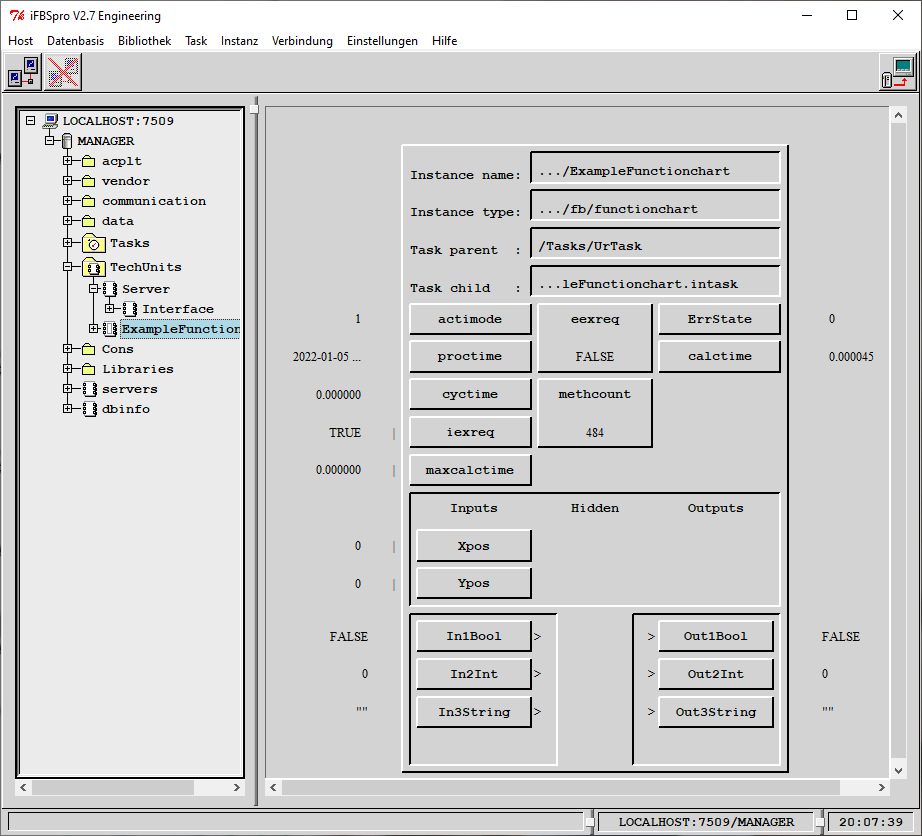
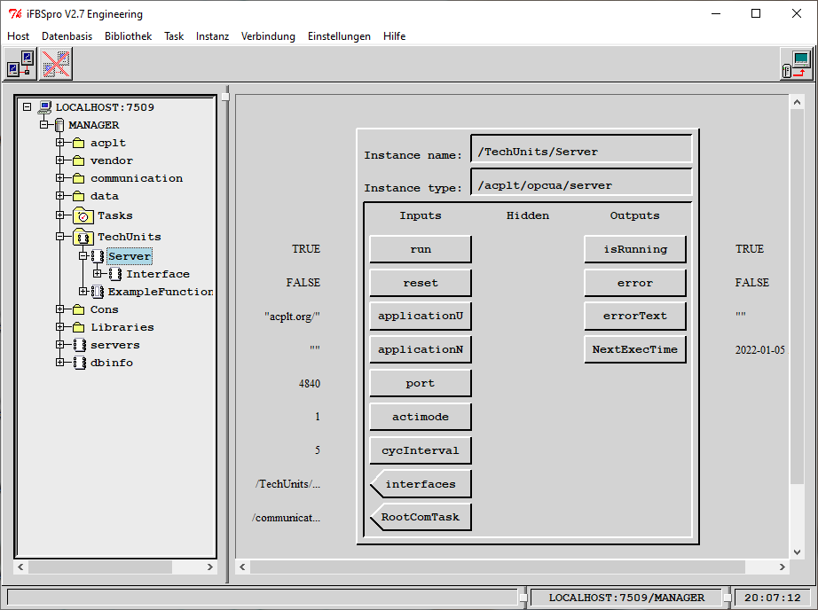

# ACPLT/RTE example project for OPC UA Server interfaces

This project shows how to write a specialiced interface class for the [opcua](https://github.com/acplt/rte/tree/master/syslibs/opcua) library to utilize custom transformations from OV to OPC UA or to use OPC UA Companion Specifications.

## Simple Demo "interface"

The repository contains a [demo](demo) ov library, a [demo fbd file](doc/Demo.fbd), some [screenshots](doc) and some boilerplate [template](template) files.
The example fbd for the demo contains an OPC UA server from `opcua` ov library, a custom interface from this demo library and an example functionchart from the fb library, that is show in the following screenshot.



The example functionchart contains three input ports (In1Bool, In2Int, In3String) from different types
They are connected to an output port (Out1Bool, Out2Int, Out3String) of the corresponding type each.
The fb connections are contained in the ExampleFunctionchart.
The idea of the demo library is to change the generic transformation of fb functioncharts as shown in the next two screenshots.


The custom `interface` class in the demo library, which is derived from the abstract interface in the opcua library, contains a transformation, which is defined in `trafo.c`.
Transformations are encapsulated in custom OPC UA nodestores.
The demo transformation changes the OPC UA representation of every functioncharts generically by:

* removing some variables except for `actimode`
* creating two virtual (=only in OPC UA seen) folders: `STATUS` and `OPERATIONS`
* replacing output ports (which are own objects in OV) with OPC UA read only properties and collecting them under the STATUS folder
* replacing input ports with OPC UA methods inside the OPERATIONS folder with one parameter as kind of setter methods

### Prerequisites

Before running the demo make sure:

* You can build this project according to [ACPLT/RTE README](https://github.com/acplt/rte) and run an ov_runtimeserver
* You have an ACPLT/KS client to load the [Demo.fbd](doc/Demo.fbd), e.g. [fb_dbcommands](https://github.com/acplt/dbcommands) or [iFBSpro](https://github.com/ltsoft-gmbh/ifbspro)
* You have an OPC UA client, e.g. [FreeOpcUa Client GUI](https://github.com/FreeOpcUa/opcua-client-gui) or [UaExpert](https://www.unified-automation.com/de/produkte/entwicklerwerkzeuge/uaexpert.html)

### Run the demo

* Start the ov_runtimeserver, e.g. via CLI:

    ```sh
    ov_runtimeserver -f test.ovd -s MANAGER -l stdout -c 10000000 --force-create -w ksbase -w kshttp -w TCPbind -w fb -w ksxdr -w opcua -w demo
    ```

* Load the [Demo.fbd](doc/Demo.fbd) fbd via a KS client.
* Start the OPC UA Server
  * Optional: configure the `/TechUnits/Server` and `/TechUnits/Server/Interface`, e.g:
    * Change the Server.port to 16664
    * Change the Interface.entryPath to `/TechUnits`
    * Note: some variables can only be chaned if the OPC UA server is stopped
  * Set `/TechUnits/Server.run` to true
    * check that the server is started via `/TechUnits/Server.isRunning`



View the ov_runtimeserver from OPC UA Client:

* connect via an OPC UA client to `opc.tcp://localhost:4840`
* browse to `0:Root/0:Objects/1://1:TechUnits/1:ExampleFunctionchart`

=> the ExampleFunctionchart should look like:


* Now you can play around, e.g.:
  * read the output properties beneath the STATUS folder
  * call a method, e.g. In1Bool to change the input (and after execution of the functionchart) also the connected output value (Out1Bool)
  * start (1) or stop (0) the functionchart by changing actimode
* Or you can change between the generic version and the version with the active demo transformation:
  * stop the OPC UA server from a KS client: set `/TechUnits/Server.run` to false
  * unlink `/TechUnits/Server/Interface.server` from `/TechUnits/Server.interfaces`
  * start the OPC UA server again: set `/TechUnits/Server.run` to true

## Demo with nodeset and data types

The demo library contains a second example with a `interfaceTypes` class and corresponding `trafoTypes` transformation functions, as well as a very simple generated `nodeset` file with two custom datatypes:

* Actimode: an enumeration with values ON/OFF that should represent the actimode of fb tasks
* Identifier: a struct that consists off two integers idH and idL (ids of OV objects).
 